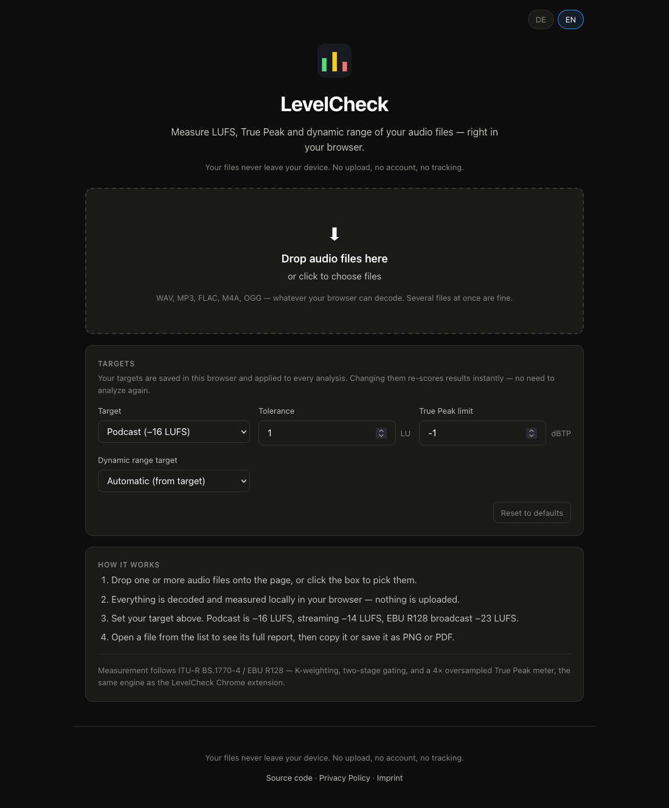
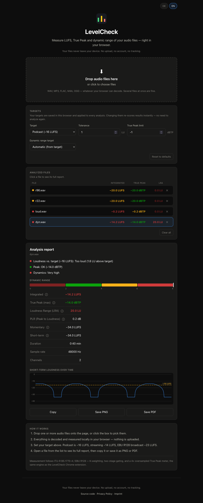
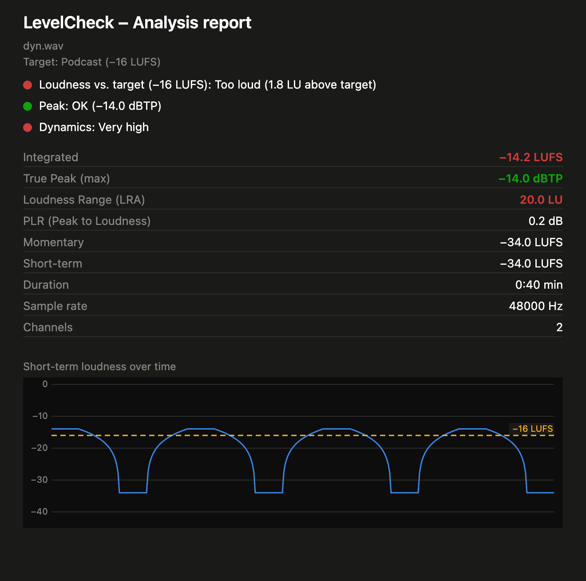

# LevelCheck
A privacy-first web app that measures the loudness (LUFS), True Peak and dynamic range of your audio files. Drop in a file — or a whole batch — and get a full EBU R128 report with a loudness graph you can copy, or save as PNG or PDF. Everything runs locally in your browser: no upload, no account, no tracking.

🌐 **[Try it live → macusercom.github.io/levelcheck](https://macusercom.github.io/levelcheck/)**


## Features
- Drag & drop audio files anywhere on the page, or click to pick them — several at once
- Integrated, Short-Term and Momentary loudness in LUFS
- True Peak in dBTP with 4× oversampling, so inter-sample peaks are caught
- Dynamic range as LRA (EBU Tech 3342), plus PLR (Peak-to-Loudness Ratio)
- Traffic-light verdicts — too quiet / just right / too loud, how much dynamics, and whether it clipped
- Short-term loudness graph over the whole file, with your target drawn in
- Export any report as PNG or PDF, or copy it as text
- Loudness targets: Podcast (−16 LUFS), Streaming (−14 LUFS), Broadcast EBU R128 (−23 LUFS), None, or your own value
- Your own dynamic range target, tolerance and True Peak limit
- Targets are stored locally in your browser and survive a reload — no cookies, nothing sent anywhere
- Changing a target re-scores every analyzed file instantly, with no re-analysis
- Compare a batch at a glance: every file listed with its key values, colour-coded against your targets
- Info icons (ⓘ) next to every value explaining what it means
- German and English UI, follows your browser language
- No audio or data ever leaves your machine

Measurement follows ITU-R BS.1770-4 / EBU R128 (K-weighting, two-stage gating) using the same DSP core as the LevelCheck Chrome extension, so results match between the two.


## How To Use
1. Open **[macusercom.github.io/levelcheck](https://macusercom.github.io/levelcheck/)** in your browser
2. Drop one or more audio files onto the page, or click the box to choose them
3. Pick your target — Podcast, Streaming, Broadcast, or a custom value
4. Read the verdicts, then click any file in the list to open its full report
5. Copy the report, or save it as **PNG** or **PDF**

No install required. Works on mobile and desktop. Supported formats are whatever your browser can decode — WAV, MP3, FLAC, M4A and OGG in current Chrome, Edge, Firefox and Safari.


## Run Locally

The app uses ES modules, so opening `index.html` directly as `file://` will not work — it needs a local server.

```
git clone https://github.com/Macusercom/levelcheck.git
cd levelcheck
python3 -m http.server
```

Then open [http://localhost:8000](http://localhost:8000) in your browser.


## Tech
- Vanilla HTML, CSS, JavaScript — no framework, no build step, no dependencies
- Decoding via the Web Audio API, metering in a pure-JS BS.1770-4 implementation (`dsp/loudness-core.js`)
- Reports, charts and the PNG/PDF export are drawn on a `<canvas>`; the PDF is written by hand, so nothing is loaded from a CDN
- Settings are kept in `localStorage`

No data ever leaves your device. Built as a vibe coding project with [Claude](https://claude.ai).


## Images

<table>
  <tr>
    <td width="33%" align="center">
      <br>
      <sub><b>Start</b> — drop files and set your targets</sub>
    </td>
    <td width="33%" align="center">
      <br>
      <sub><b>Analysis</b> — batch list and full report</sub>
    </td>
    <td width="33%" align="center">
      <br>
      <sub><b>Export</b> — the report as PNG or PDF</sub>
    </td>
  </tr>
</table>
